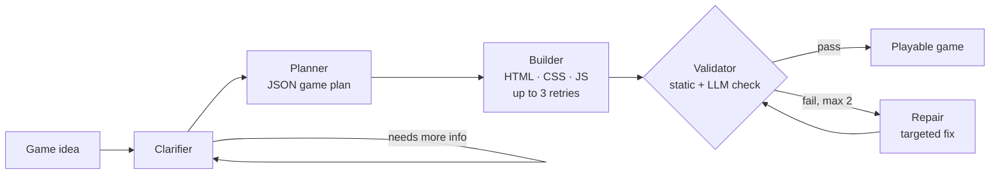

<h1 align="center">Agentic Game Builder</h1>

<p align="center">
  <b>Describe a game in plain English. A team of AI agents clarifies, plans, builds, validates and repairs it into a playable browser game.</b>
</p>

<p align="center">
  <a href="https://drive.google.com/file/d/1CUDBPYp_mgWnRbgeW4WAUWuMQs6DjtGV/view?usp=drive_link"></a>
</p>

<p align="center">
  
  
  
  
  
</p>

<p align="center">
  <a href="#how-it-works">How it works</a> ·
  <a href="#quickstart">Quickstart</a> ·
  <a href="#architecture">Architecture</a> ·
  <a href="#design-decisions">Design decisions</a> ·
  <a href="#trade-offs">Trade-offs</a> ·
  <a href="#roadmap">Roadmap</a>
</p>

---

## Overview

Input: *"A space shooter where I fly a rocket and shoot asteroids."*
Output: `index.html`, `style.css` and `game.js` that run in any browser.

One-shot LLM code generation often returns placeholder code, missing game loops or broken structure. This project treats game generation as a **multi-agent workflow with a validation and repair loop**, so failures are caught and fixed before the user sees them.

- **Clarifies before building:** asks up to 3 targeted questions instead of guessing
- **Plans in structured JSON:** mechanics, controls, entities, sizes, speeds, spawn rates
- **Validates its own output:** static structural checks plus an optional LLM semantic review
- **Repairs surgically:** fixes only the reported issues, with a bounded loop to cap cost
- **Streams live:** each phase appears in the web UI in real time over Server-Sent Events

---

## How it works



| Phase | What it does |
|---|---|
| **Clarify** | Generates up to 3 questions and loops until requirements are complete. Works in both CLI and web mode. |
| **Plan** | Turns requirements into a structured JSON plan with concrete values (sizes, speeds, spawn rates). |
| **Build** | Generates the three files from the plan, checks their structure and retries up to 3 times if malformed. |
| **Validate** | Static checks for file linkage, canvas and context, visible elements, input handling, game loop, score/lives, collision, and brace/parenthesis balance, then an optional LLM semantic check. |
| **Repair** | Receives the issue list and fixes only the broken parts; capped at 2 iterations. |

---

## Quickstart

**Prerequisites:** Docker, or Python 3.12+, and an OpenAI API key.

### Docker (recommended)

```bash
git clone https://github.com/sampro14/agentic-game-builder.git
cd agentic-game-builder

docker build -t game-builder-agent .
docker run -p 8000:8000 \
  -e OPENAI_API_KEY=sk-your-key-here \
  -v $(pwd)/output:/app/output \
  game-builder-agent
```

Open **http://localhost:8000**. On Windows PowerShell, replace `$(pwd)` with `${PWD}`.

Or with Docker Compose:

```bash
export OPENAI_API_KEY=sk-your-key-here
docker compose up --build
```

### Local Python

```bash
git clone https://github.com/sampro14/agentic-game-builder.git
cd agentic-game-builder
python -m venv venv
source venv/bin/activate          # Windows: venv\Scripts\activate
pip install -r requirement.txt
cp .env.example .env              # add OPENAI_API_KEY

uvicorn app:app --reload          # web UI at http://localhost:8000
python main.py                    # or CLI mode
```

### Using the web UI

1. Enter a game idea and click **Analyse Idea**
2. Answer the clarifying questions, then click **Build Game**
3. Follow the pipeline in **Agent Log**; inspect **Game Plan** and **Validation**
4. Play it in **Preview**, view the code in **Source**, or download the files

Generated files are written to `./output/`.

---

## Architecture

Built on **LangGraph** (stateful graph orchestration) with **LangChain + OpenAI**. The backend is **FastAPI**, streaming progress to the browser over **Server-Sent Events**.

| Component | File | Responsibility |
|---|---|---|
| State | [`graph/state.py`](graph/state.py) | Typed shared state (`GameState` TypedDict) passed between nodes |
| Workflow | [`graph/workflow.py`](graph/workflow.py) | LangGraph `StateGraph`: nodes, edges, conditional routing |
| Clarifier | [`agents/clarifier.py`](agents/clarifier.py) | Question generation and requirement completeness detection |
| Planner | [`agents/planner.py`](agents/planner.py) | Requirements → structured JSON game plan |
| Builder | [`agents/builder.py`](agents/builder.py) | Plan → HTML/CSS/JS with structural retries |
| Validator | [`agents/validator.py`](agents/validator.py) | Static checks + optional LLM semantic check → issue list |
| Repair | [`agents/repair.py`](agents/repair.py) | Targeted fixes from the issue list |
| Server | [`app.py`](app.py) | `/clarify` and `/build/stream` (SSE) endpoints |
| Frontend | [`frontend/index.html`](frontend/index.html) | 5-tab UI: Log · Plan · Validation · Preview · Source |
| Prompts | [`prompts/`](prompts/) | One prompt file per agent, kept out of the code |
| Cache | [`utils/cache.py`](utils/cache.py) | SHA-256 prompt cache for fast development iteration |
| Tracer | [`utils/tracer.py`](utils/tracer.py) | Per-run JSON traces in `debug/trace.json` |

---

## Design decisions

**LangGraph for orchestration.** The clarification and repair loops are naturally graph edges with conditional routing. `clarification_router` loops back until requirements are complete; `validation_router` sends to repair up to 2 times before ending.

**A working game as the builder's template.** The builder prompt includes a fully implemented game as a structural reference, which sharply reduces placeholder comments in place of real code.

**One agent, two interfaces.** The clarifier detects when answers are already supplied by the web UI and skips interactive input, so the same agent runs in CLI and web mode.

**Streaming without blocking.** `/build/stream` runs the graph in a thread pool (`run_in_executor`) and emits SSE events per phase, so the Plan and Validation tabs populate as soon as each is ready.

---

## Trade-offs

| Decision | Chosen | Alternative | Why |
|---|---|---|---|
| Model | `gpt-4o-mini` | `gpt-4o` | ~30–60 s per full run; `gpt-4o` would improve code quality at roughly 10× the cost |
| Validation | Static pattern checks | Headless-browser execution | Much faster to build; catches structural problems, but not runtime errors (see roadmap) |
| Behaviour control | Prompts | Fine-tuning | No labelled data or training infrastructure needed; requires careful prompt iteration |
| Frontend | Single HTML file | React / Vue | Trivial to serve; less maintainable at scale |
| Repair loop | Capped at 2 | Unbounded | Prevents runaway API cost; occasionally a third pass would help |
| LLM cache | On in development | Off | Fast iteration; must be cleared for real evaluation runs |

---

## Roadmap

- [ ] **Execution sandbox:** run `game.js` in headless Chromium (Playwright) to catch runtime exceptions, verify canvas draws and input response
- [ ] **Regression suite:** 20–30 game ideas with expected outcomes, run on every prompt change
- [ ] **More genres and engines:** Phaser 3 scenes, a genre classifier and genre-specific builder prompts
- [ ] **Conversational repair:** "the shooting doesn't work" routes user feedback back into the repair agent
- [ ] **Token-level streaming** of each agent's output to the UI
- [ ] **Asset generation:** sprites instead of coloured shapes
- [ ] **Build history:** store, replay, fork and share previous builds

---

<p align="center">
  Built by <a href="https://github.com/sampro14">Sameer Atram</a>
</p>
